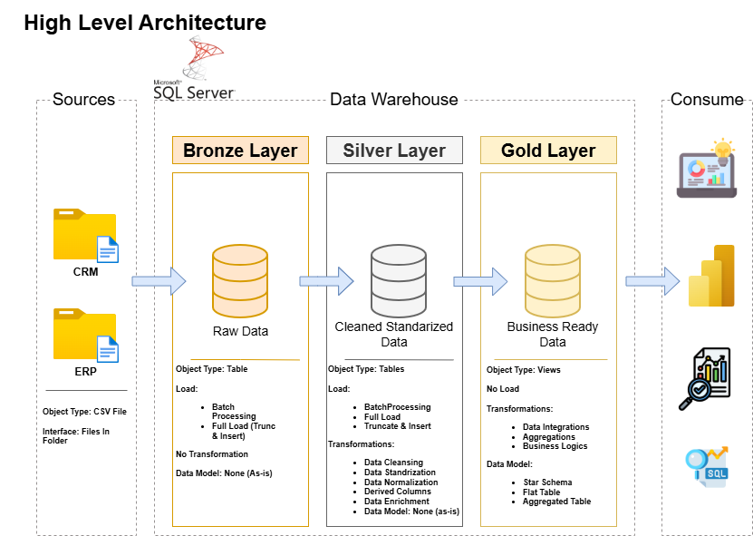

# 📊 Data Warehouse Project

This project focuses on transforming raw data into structured insights using SQL Server. It demonstrates a simple end-to-end workflow from data ingestion to analysis.

---
## 🏗️ Data Architecture

This project follows a layered approach:

- **Bronze** → Raw data from source  
- **Silver** → Cleaned and transformed data  
- **Gold** → Analysis-ready data model  

📊 *(Architecture diagram added below)*

## 🏗️ Approach

- Data collected from CSV files  
- Processed and cleaned using SQL  
- Organized into analytical tables for reporting  

---

## ⚙️ Tech Stack

SQL Server · SSMS · Excel · Draw.io  

---

## 📈 Work Done

- Built basic ETL flow  
- Designed structured tables  
- Performed analysis using SQL queries  

---

## 📂 Project Structure

datasets/ → raw data  
scripts/ → SQL queries  
docs/ → diagrams  

---

## 🛡️ License

MIT License

---

## 💡 About Me

I’m Sayan Naha, an aspiring Data Analyst focused on building practical solutions using SQL and data analytics.
